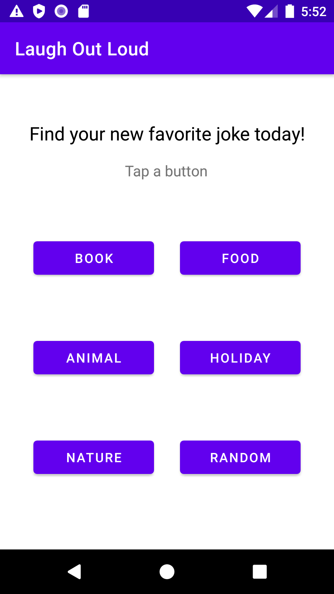
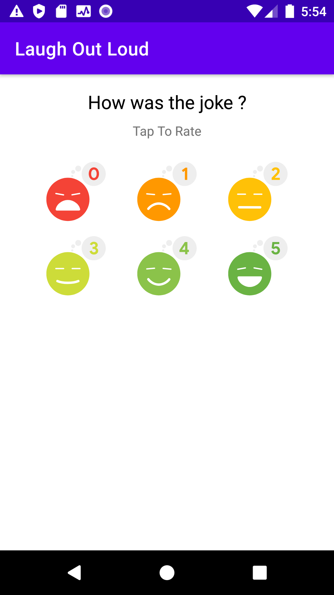

# Project Title: Laugh Out Loud - Android App for daily joke development using OpenAI GPT API

Welcome to Laugh Out Loud, the ultimate Android app for daily joke development! With Laugh Out Loud, you can enjoy a hilarious selection of jokes in various categories, including book, nature, holiday, animals, and food (more categories will be included soon!). 
Our app leverages the power of OpenAI GPT API to generate a virtually endless stream of jokes for your entertainment. Simply request as many jokes as you like, and rate them.
Whether you're looking to brighten up your day or share some laughter with friends, Laugh Out Loud has got you covered. 
Download the app today and let the jokes begin!

## How to Run the Application

To run the application, follow these steps:

1. Clone the repository - The user should start by cloning the repository on their local machine.
2. Create a "local.properties" file in the root directory of the project and add your own API key as a property with the name API_KEY.(refer to "How to generate an API Key" section below)
3. Open the project in Android Studio - The user should open the project in Android Studio by selecting "Open an existing Android Studio project" and navigating to the root directory of the project.
4. Build the project - The user should then build the project by selecting "Build > Make Project" or by pressing "Ctrl+F9" on Windows or "Cmd+F9" on Mac.
5. Run the app - The user can run the app on an emulator or a connected device by selecting "Run > Run 'app'" or by pressing "Shift+F10" on Windows or "Cmd+R" on Mac.

Note: If running on an emulator, the user should first create an emulator by selecting "Tools > AVD Manager" and following the prompts to create a new virtual device.

Sure, here's an example of how you can add information about generating an API key for OpenAI GPT API:

## How to Generate an API Key 

To use OpenAI GPT API in your Laugh Out Loud app, you need to generate an API key and add it to your project's `local.properties` file. Here are the steps to generate an API key:

1. Sign up for an OpenAI account: Go to the [OpenAI website](https://beta.openai.com/signup/) and sign up for an account. You will need to provide your name, email address, and credit card information.
2. Create an API key: After signing up, navigate to the [API keys page](https://beta.openai.com/api-keys/) and click on the "Create new API key" button. Give your API key a name and select the appropriate permissions for your needs.
3. Copy the API key: Once you've created an API key, you will see it listed on the API keys page. Click on the "Copy" button next to the API key to copy it to your clipboard.
4. Add the API key to your project: Create a `local.properties` file in the root directory of your Laugh Out Loud project if it doesn't already exist. Then add the following line to the file, replacing `YOUR_API_KEY` with your actual API key

That's it! With your API key added to the `local.properties` file, your Laugh Out Loud app can now use the OpenAI GPT API to generate jokes.

## Features

1. There will be at least 5 categories like book, nature, holiday, animals, food and also u can request a random joke.(More categories will be added soon!)

2. User may request as many as jokes each day. The app uses OpenGPT API to generate jokes. 

 

3. User can rate jokes from 0 to 5. 5 is a very good joke, 0 is not a good joke.
   

## Contributions

We welcome contributions from the community! If you find any bugs or have suggestions for new features, please open an issue or submit a pull request. All contributions are appreciated.

Thank you for choosing Laugh Out Loud. We hope you enjoy the app and have a good laugh!

